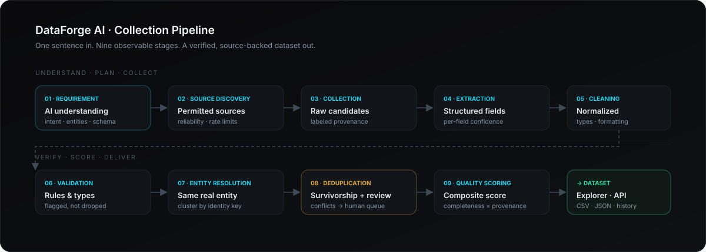
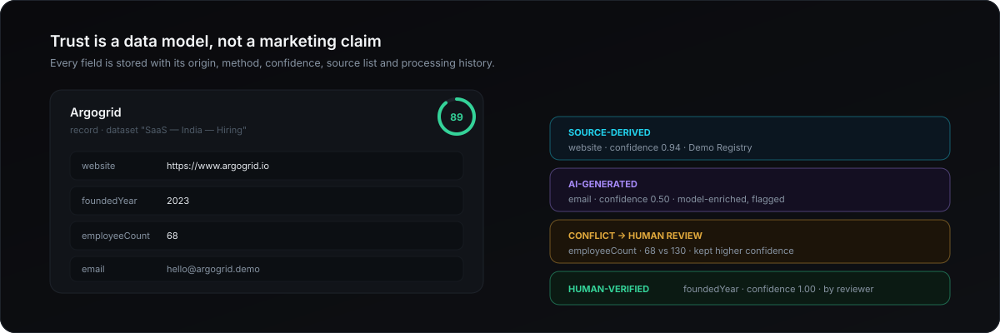

<div align="center">

# DataForge AI

**Describe the Data. We Build the Intelligence.**

An AI data intelligence platform that turns one sentence into a planned, collected,
validated, deduplicated, source-backed dataset — with per-field traceability.

[](#stack)
[](#stack)
[](#stack)
[](#stack)
[](#ai-layer)
[](#database)

<sub>Not a scraper. Not a chatbot bolted to a table. A pipeline engine with provenance, review, and quality scoring at its core.</sub>

</div>



---

## The loop

```text
USER REQUEST → AI UNDERSTANDS → AI PLANS → SYSTEM COLLECTS → AI CLEANS
→ AI RESOLVES ENTITIES → SYSTEM VALIDATES → QUALITY ENGINE SCORES
→ USER REVIEWS → DATASET DELIVERED → WORKFLOW REUSABLE
```

Every stage is observable. Nothing happens in a black box, and nothing is asserted about a
source that wasn't actually touched.

## Quick start

Zero configuration — no database server, no Redis, no API key required.

```bash
npm install
npm run db:push     # creates prisma/dev.db from the SQLite schema twin
npm run db:seed     # demo org, 3 users, source registry, a completed dataset with real conflicts
npm run dev         # → http://localhost:3000
```

| Role | Email | Password |
| :--- | :--- | :--- |
| **Admin** | `admin@demo.dataforge.ai` | `demo1234` |
| **Analyst** | `analyst@demo.dataforge.ai` | `demo1234` |
| **Viewer** | `viewer@demo.dataforge.ai` | `demo1234` |

Add `GROQ_API_KEY` to `.env` for live LLM parsing, planning, insights, and copilot.
Without it, a deterministic local engine handles every stage — the product never hard-fails.

> Viewer is blocked from write endpoints server-side, not just hidden in the UI. Every query is
> scoped by `orgId`.

## The 3-minute demo

Enter one sentence and watch the loop close:

```
"Find Indian SaaS companies founded after 2021 that are hiring Node.js developers."
```

| Step | Where | What you see |
| :-- | :-- | :-- |
| 1 | `/build` | Groq extracts `LEAD_GENERATION · companies · India · SaaS · Node.Js · founded after 2021` |
| 2 | `/build` | Editable output schema — field types, required flags, per-field provenance |
| 3 | `/build` | Generated workflow with domain-specific stages (it invents *Job Verification* when hiring matters) |
| 4 | `/workflows/:id` | Live node-by-node progress over SSE: records processed, duration, errors, source count |
| 5 | `/workflows/:id` | Duplicate collapse, conflicts flagged — never silently resolved |
| 6 | `/datasets/:id` | Explorer with per-record quality rings, filters, composition, lineage |
| 7 | `/datasets/:id` | Click any record → field value, source, confidence, and processing history |
| 8 | `/datasets/:id` | **AI Insight** briefing grounded in dataset statistics only |
| 9 | `/copilot` | *"Which companies have the highest quality records?"* — answers cite actual records |
| 10 | `/reviews` | Approve / correct / reject conflicting values; corrections become `HUMAN-VERIFIED` |
| 11 | `/datasets/:id` | CSV + JSON export (JSON ships a provenance manifest) |

## Trust model



Quality is computed transparently, never asserted:

```text
quality = 0.55 · completeness + 0.35 · provenance + 0.10 · (1 − conflict penalty)
```

with provenance weighted by origin (`SOURCE` 1.0 · `DEMO` 0.75 · `USER` 0.6 · `AI_GENERATED` 0.45)
and scaled by confidence. AI-enriched fields carry low confidence by construction; conflicting
fields have theirs *lowered* and open a review item that names both sources.

## Architecture

```text
src/app              pages + 25 REST route handlers (real HTTP boundaries)
 ├─ (app)/            authenticated workspace: dashboard, build, workflows, datasets, sources,
 │                    search, copilot, quality, reviews, history, settings, admin
 └─ api/              auth · ai · datasets · jobs (SSE) · records · reviews · search · sources · admin

src/lib
 ├─ ai/               provider abstraction (Groq + model fallbacks), requirement parser,
 │                    workflow planner, copilot, insights, embeddings
 ├─ pipeline/         engine (9 stages) · durable queue + SSE pub/sub · demo factory · source registry
 ├─ auth.ts           session tokens, bcrypt, RBAC (ADMIN / ANALYST / VIEWER)
 └─ api.ts            auth wrapper, role enforcement, error normalization

prisma               schema twins (Postgres + SQLite) · seed
docs                 brand diagrams
```

**Data model** — `Organization` → `User`/`Session`/`PasswordResetToken`, `OrganizationSource`,
`Dataset` → `Record` → `FieldProvenance`, `Job` → `JobEvent`, `Review`, `CopilotMessage`.

## Stack

| Layer | Choice |
| :-- | :-- |
| Frontend | Next.js 15 (App Router), TypeScript, Tailwind CSS, Framer Motion, Recharts, Lucide, TanStack Query, Zod |
| Backend | Next.js Route Handlers + service layer (swap-ready for NestJS controllers) |
| Database | Prisma ORM — PostgreSQL (production) and SQLite (zero-config local) twins |
| Jobs | Durable DB-backed queue, single-flight worker, stuck-job recovery, SSE live progress (BullMQ swap-ready) |
| Search | Hashed-embedding vectors + cosine similarity blended with keyword matching |
| AI layer | Provider-independent: Groq (OpenAI-compatible, model fallbacks) with deterministic local fallback |

<a id="ai-layer"></a>

### AI layer

Every AI capability degrades gracefully — the provider so happens to be Groq today:

| Capability | Endpoint | Fallback behavior |
| :-- | :-- | :-- |
| Requirement understanding | `POST /api/ai/interpret` | regex/heuristic parser |
| Workflow planning | `POST /api/ai/plan` | deterministic stage template |
| Dataset insights | `POST /api/datasets/:id/insights` | statistic-derived briefing |
| Copilot Q&A | `POST /api/copilot` | deterministic analytics answers |
| Semantic search | `POST /api/search` | local embeddings + keyword |

<a id="database"></a>

### Database

```bash
npm run db:use:postgres    # activates prisma/schema.postgres.prisma (needs DATABASE_URL)
npx prisma generate && npx prisma db push && npm run db:seed

npm run db:use:sqlite      # back to zero-config local (prisma/dev.db)
```

Both schemas validate cleanly and are kept in sync. JSON payloads are stored as `TEXT`
so the same code runs on either dialect.

## API surface

| Method | Route | Purpose |
| :-- | :-- | :-- |
| `POST` | `/api/auth/register` · `/login` · `/logout` | sessions, org creation |
| `POST` | `/api/auth/forgot-password` · `/reset-password` | token-based recovery |
| `POST` | `/api/onboarding` | organization profile |
| `POST` | `/api/ai/interpret` · `/api/ai/plan` | requirement → schema → workflow |
| `GET/POST` | `/api/datasets` | list · create + enqueue pipeline |
| `GET/PATCH/DELETE` | `/api/datasets/:id` | detail, records, stats, rename, archive |
| `GET` | `/api/datasets/:id/export?format=csv\|json` | export with provenance manifest |
| `POST` | `/api/datasets/:id/insights` | AI briefing |
| `GET` | `/api/jobs` · `/api/jobs/:id` | history, node runtimes, stats, events |
| `GET` | `/api/jobs/:id/stream` | **SSE** live progress |
| `POST` | `/api/jobs/:id/cancel` | cancel queued/running job |
| `GET` | `/api/records/:id` | field-level provenance + history |
| `GET/POST` | `/api/reviews` | queue · approve / correct / reject |
| `POST` | `/api/search` | semantic + keyword hybrid |
| `GET/PATCH` | `/api/sources` | registry · enable/disable |
| `GET/POST` | `/api/copilot` | dataset-grounded Q&A |
| `GET` | `/api/overview` | command-center metrics |
| `GET/PATCH` | `/api/admin/stats` · `/api/admin/users` | admin-only |

## Product principles

These are enforced in code, not in copy:

> **Never fabricates collected data.** Synthetic records are labeled `DEMO` on every field.
>
> **Never claims a source was accessed when it wasn't.** The registry separates demo, file, and
> connector sources, and reports availability honestly.
>
> **Never silently resolves conflicts.** Disagreement keeps the higher-confidence value and opens a
> review item naming both sources.
>
> **Never hides uncertainty.** Confidence is stored and displayed per field; AI enrichment is
> labeled and low-confidence by construction.
>
> **Labels everything.** `SOURCE-DERIVED` · `AI-GENERATED` · `USER-PROVIDED` · `HUMAN-VERIFIED` · `DEMO DATA`.

## Deployment

- **App** → Vercel (`npm run build`)
- **Database** → Neon / Supabase (`npm run db:use:postgres` + `DATABASE_URL`)
- **Env** → `DATABASE_URL`, `APP_SECRET`, optional `GROQ_API_KEY`, `GROQ_MODEL`

> ⚠️ `npm run build` on Windows requires the dev server to be stopped — it holds a lock on the
> Prisma engine DLL.

## Roadmap

- [ ] Live CSV / JSON / RSS connectors with user-supplied URLs and robots-aware fetching
- [ ] Scheduled pipeline refreshes with drift detection against the previous snapshot
- [ ] BullMQ + Redis worker for multi-instance horizontal scaling
- [ ] pgvector-backed embeddings at production scale
- [ ] Webhook + signed export API for downstream systems

---

<div align="center">
<sub><b>From one sentence to a verified, source-backed dataset.</b></sub>
</div>
